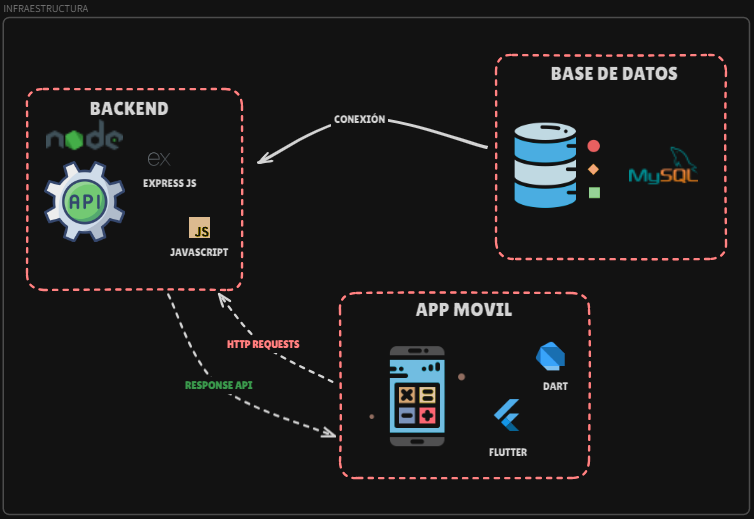

# Esto es un Backend Hecho con Express

## Descripción

Este proyecto es un backend desarrollado con **Express** en **JavaScript**, utilizando una **arquitectura modular** para organizar el código de manera eficiente y escalable. La API está diseñada para una aplicación de venta de productos ofrecidos por agricultores, brindando una solución fácil de usar para la gestión y comercialización de productos agrícolas.

### Características Principales:
- **Express**: Un framework web rápido, minimalista y flexible para Node.js.
- **Arquitectura Modular**: Cada funcionalidad del sistema está organizada en módulos independientes para facilitar el mantenimiento y la escalabilidad del código.
- **JavaScript**: Toda la lógica del backend está escrita en JavaScript, lo que permite un desarrollo ágil y una integración sencilla con otras tecnologías basadas en JavaScript.
- **API RESTful**: La API está diseñada para ser intuitiva y fácil de usar, permitiendo a los desarrolladores integrar rápidamente la funcionalidad en aplicaciones frontend.
- **Enfoque en la Usabilidad**: La API está optimizada para que los agricultores puedan listar y gestionar sus productos de manera eficiente, y para que los compradores puedan acceder fácilmente a los productos que necesitan.

Este backend es la columna vertebral de una aplicación que facilita la conexión entre agricultores y consumidores, permitiendo una venta directa y simplificada de productos agrícolas.

# Infraestructura del proyecto

# Proceso del cliente 

